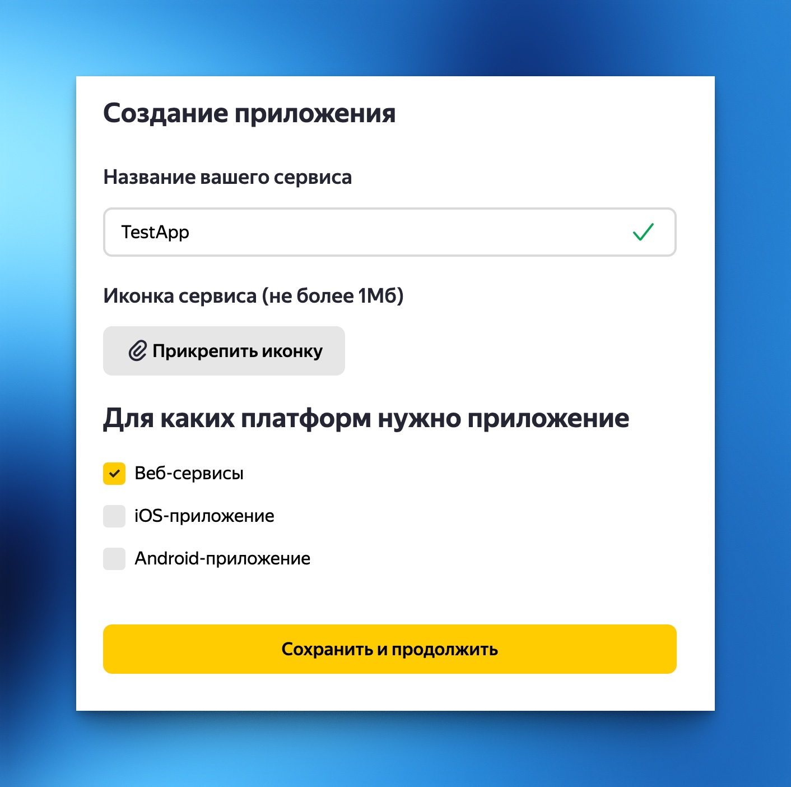
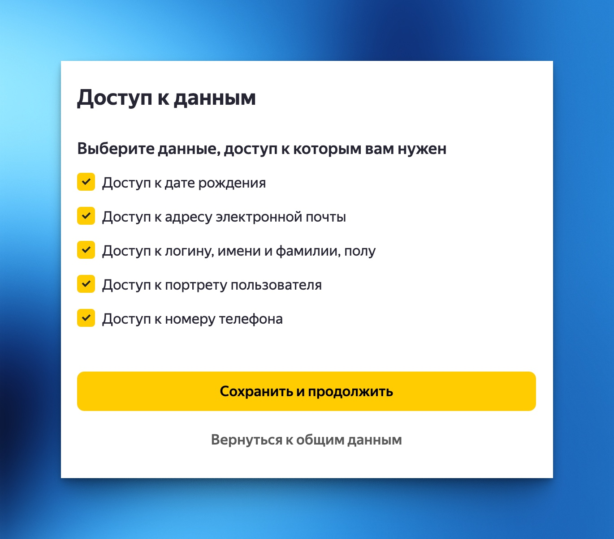
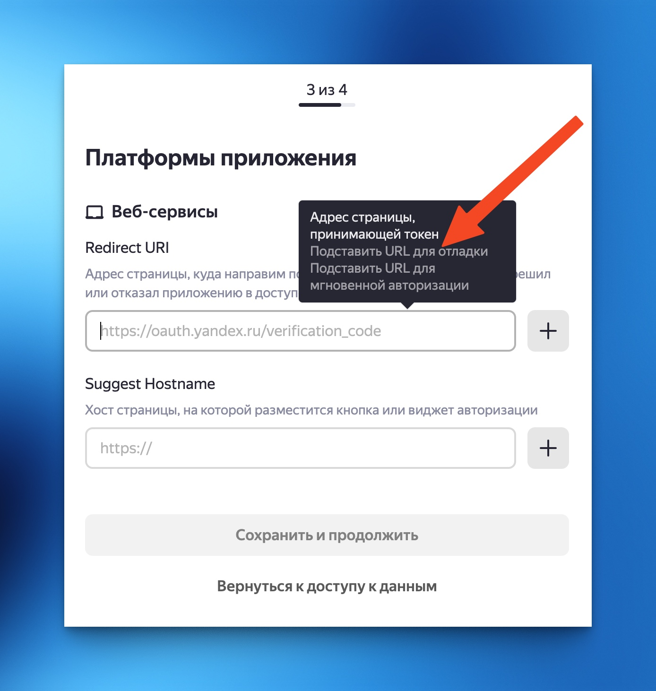
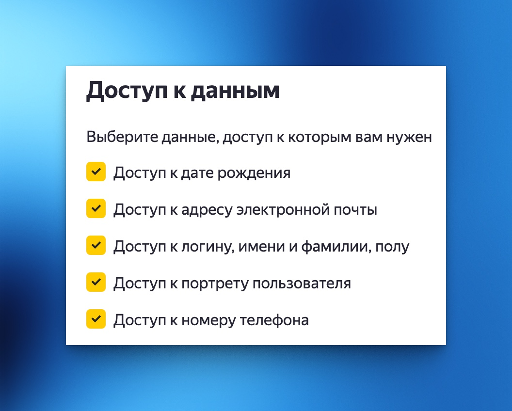
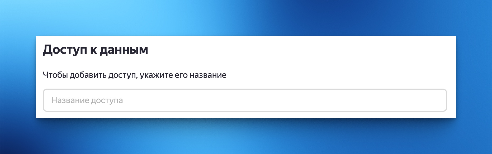
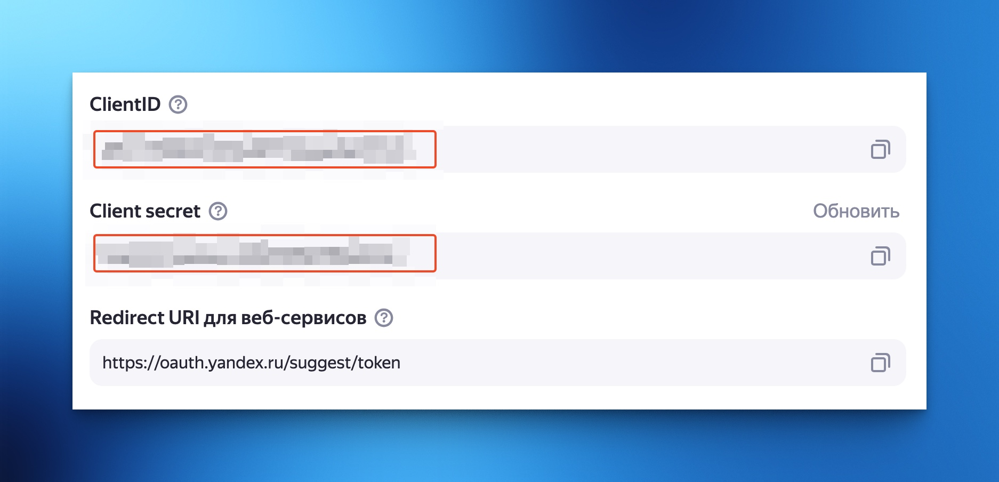
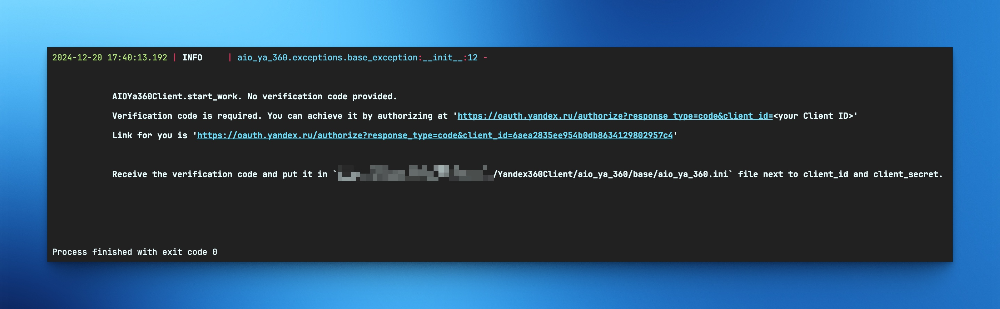
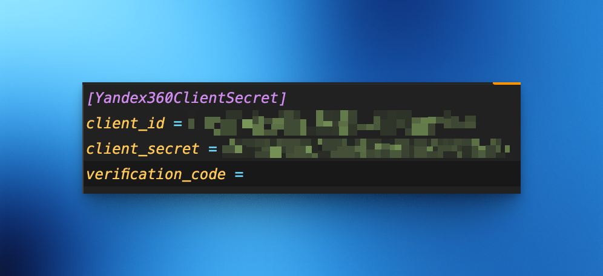

# Подготовка к работе

## Для начала работы необходимо создать сервисное приложение и выдать приложению разрешения на работу с API.
1. Убеждаемся что аккаунт имеет права администратора (а лучше владельца) организации в Яндекс 360 для бизнеса.
2. Идем на страницу [Личного кабинета Яндекс OAuth](https://oauth.yandex.ru/)
3. Создаем приложение:
   - при создании выбираем Веб-сервисы:
          
   - Доступ к данным - оставляем выбранным все галочки:
     
   - На 3 шаге кликаем на поле ввода `Redirect URL` и выбираем пункт `Подставить URL для отладки`:
   
   - `Suggest Hostname` можно не заполнять
   - Указываем почту для связи - Сервисное приложение создано.
4. Переходим к добавлению прав нашему сервисному приложению. По завершении предыдущего шага откроется страница приложения. Справа сверху будет две кнопки `Редактировать` и `Удалить`. Выбираем редактировать. 
> [!NOTE]
> Если вы счастливый обладатель бесплатного тарифа для школ, вам скорее всего откроется страница, где можно будет выбрать права только проставив галочки:
> 
> Но для использования API права нужно добавить другим способом. Для этого в адресной строке удалите `/id` в конце адреса, и добавление прав привет вид:
> 
    
5. Далее необходимо внести последовательно следующие строки для работы с API Яндекс 360 (это все есть в [документации к Яндекс API](https://yandex.ru/dev/api360/doc/ru/access)):
   - Чтение данных об организациях — `directory:read_organization`;
   - Управление организациями — `directory:write_organization`;
   - Чтение данных о подразделениях — `directory:read_departments`;
   - Управление подразделениями — `directory:write_departments`;
   - Чтение данных о группах — `directory:read_groups`;
   - Управление группами — `directory:write_groups`;
   - Чтение данных о сотрудниках — `directory:read_users`;
   - Управление сотрудниками — `directory:write_users`;
   - Чтение данных о доменах организации — `directory:read_domains`;
   - Управление доменами организации — `directory:write_domains`;
   - Управление DNS-записями — `directory:manage_dns`;
   - Чтение настроек антиспама для организации — `ya360_admin:mail_read_antispam_settings`;
   - Управление настройками антиспама для организации — `ya360_admin:mail_write_antispam_settings`;
   - Чтение настроек почты пользователя — `ya360_admin:mail_read_user_settings`;
   - Управление настройками почты пользователя — `ya360_admin:mail_write_user_settings`;
   - Чтение правил обработки почты для домена — `ya360_admin:mail_read_routing_rules`;
   - Управление правилами обработки почты для домена — `ya360_admin:mail_write_routing_rules`;
   - Чтение информации о правах доступа к почтовым ящикам — `ya360_admin:mail_read_shared_mailbox_inventory`;
   - Управление правами доступа к почтовым ящикам — `ya360_admin:mail_write_shared_mailbox_inventory`;
   - Управление обязательной 2FA для пользователей — `ya360_security:domain_2fa_write`;
   - Чтение информации о настройках cookie сессий пользователей — `ya360_security:domain_sessions_read`;
   - Управление настройками и авторизационными cookie сессиями пользователей — `ya360_security:domain_sessions_write`;
   - Чтение информации о параметрах паролей пользователей — `ya360_security:domain_passwords_read`;
   - Управление параметрами паролей пользователей — `ya360_security:domain_passwords_write`;
   - Чтение списка сервисных приложений — `ya360_security:service_applications_read`;
   - Управление списком сервисных приложений — `ya360_security:service_applications_write`;
   - Чтение событий аудит лога Диска — `ya360_security:audit_log_disk`;
   - Чтение событий аудит лога Почты — `ya360_security:audit_log_mail`.
    > [!NOTE]
    > Я выдал приложению сразу все права, чтобы один раз и не париться, но пока в модуле присутствуют не все функции и не все права нужны. По мере нахождения времени буду докидывать методы в модуль.
   
6. Сохраняем изменения, попадаем снова на страницу созданного приложения, откуда нам необходимо взять `ClientID` и `Client secret`:
    
7. Эти значения вставляем в файл `env.dist` и меняем его имя на `.env`. После этого нужно один раз запустить код из примера (в файле `app.py`) - создать объект клиента: 
   ```python
   import asyncio
   
   from environs import Env
   
   from aio_ya_360 import AioYa360Client, Ya360ClientSecrets
   
   async def main():
       env = Env()
       env.read_env()
       client = AioYa360Client(
           client_secrets=Ya360ClientSecrets.from_json(
               data={
                   'client_id': env.str('CLIENT_ID'),
                   'client_secret': env.str('CLIENT_SECRET')
               }
           )
       )
   
   if __name__ == "__main__":
       asyncio.run(main())
   ```
   При первом запуске в консоль будет выведено сообщение, что не указан `Verification code`. Будет указан способ получения этого кода (все как говорит документация Яндекса) а также прямая ссылка для получения кода.
   И также будет указан полный путь до конфигурационного файла, который создает модуль и затем с ним работает. Полученный код вставляем в этот конфигурационный файл.
   Пример вывода сообщения для меня:
   
8. Переходим по ссылке, авторизуемся (если еще не авторизовались) в браузере под тем аккаунтом, который является админом организации и который привязан к текущему сервисному приложению и получаем код. Копируем его, ищем конфигурационный файл, указанный в сообщении в консоли, вставляем скопированное значение в `verification_code`:
   
9. Также, в файле `.env` можно указать имя вашей организации, чтобы потом работать именно с ней (для удобства). Пример работы также есть в файле `app.py`:
   ```python
   import asyncio

   from environs import Env

   from aio_ya_360 import AioYa360Client, Ya360ClientSecrets, Ya360Organization
   from aio_ya_360.exceptions import Ya360Exception
   
   async def main():
       env = Env()
       env.read_env()
       client = AioYa360Client(
           client_secrets=Ya360ClientSecrets.from_json(
               data={
                   'client_id': env.str('CLIENT_ID'),
                   'client_secret': env.str('CLIENT_SECRET')
               }
           )
       )
       try:
           organizations: list[Ya360Organization] = await Ya360Organization.from_api(client=client)

           org_id = None
           for organization in organizations:
              if organization.name == env.str('ORGANISATION_NAME'):
                  org_id = organization.id
       except Ya360Exception:
           pass

   if __name__ == "__main__":
       asyncio.run(main())
   ```
   
10. Подготовка окончена. При последующих использованиях модуля будет происходить чтение конфигурационного файла и попытка обновления токена для работы с API. Яндекс говорит, что время жизни токена 1 год. Но и через год модуль сам обновит этот токен с помощью `Refresh token`-а, который также записывается в конфигурационный файл.